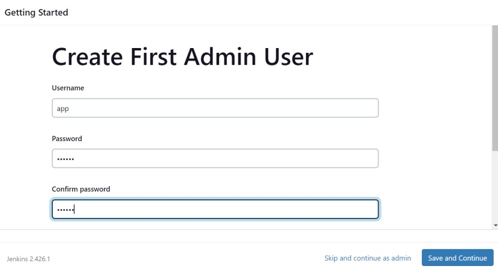
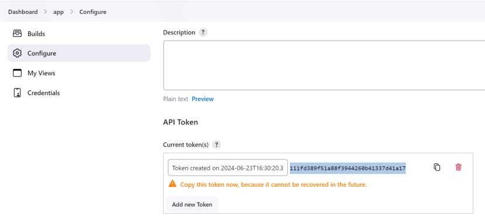
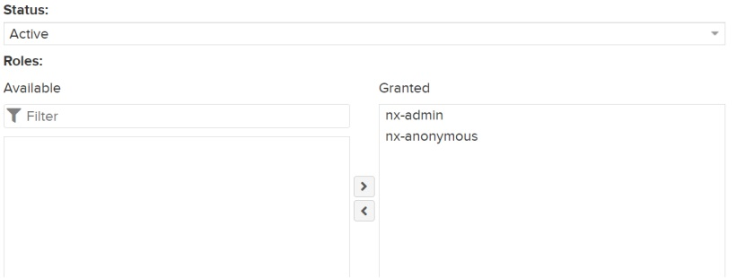
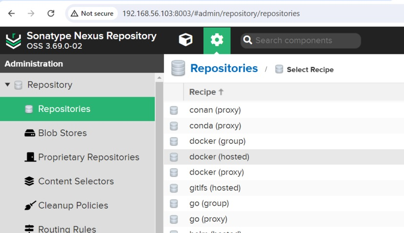
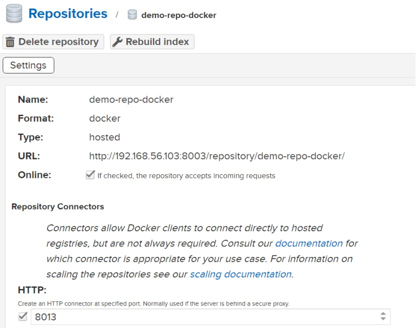
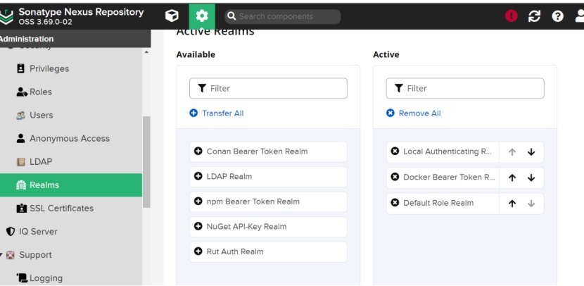
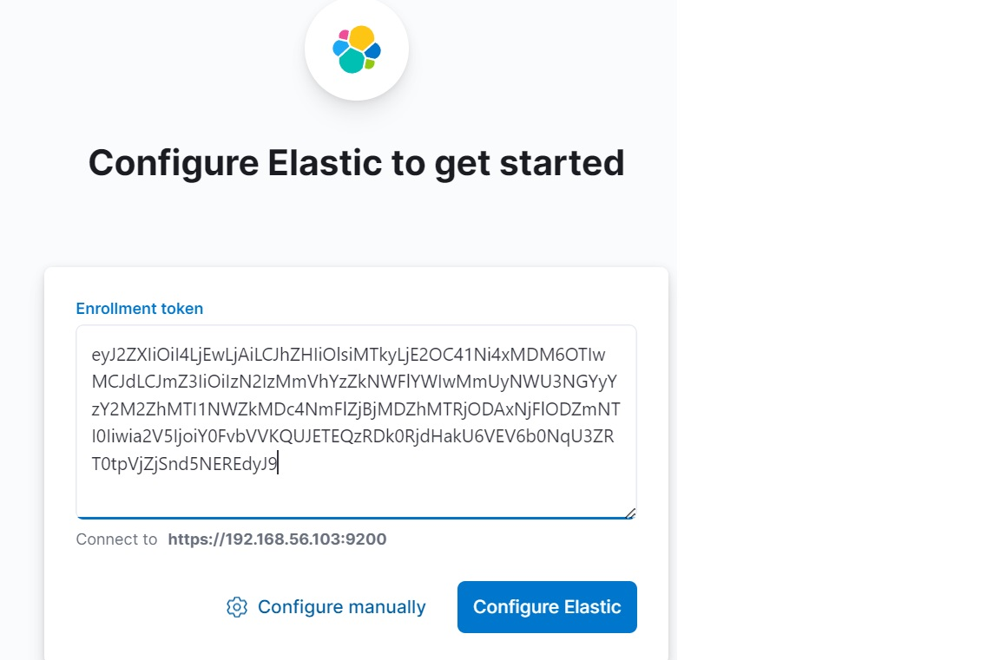
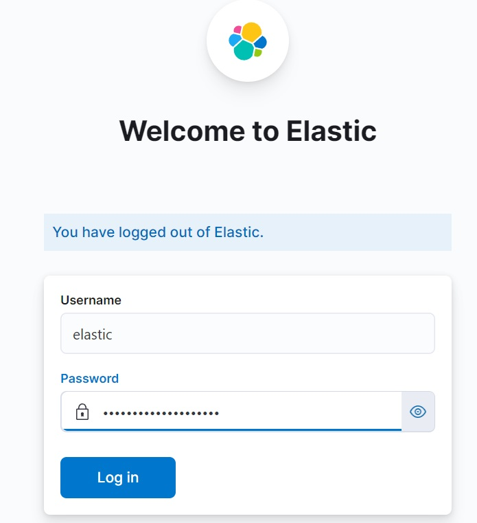
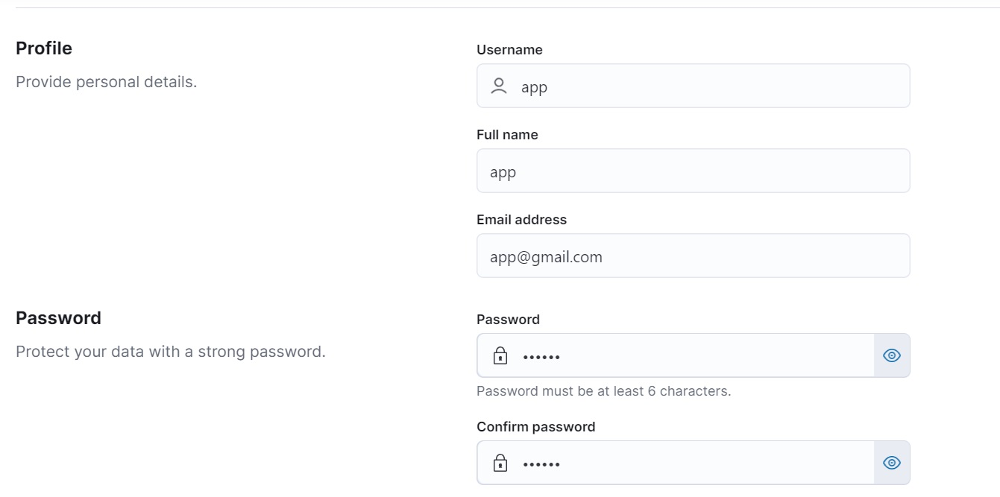

<!-- TOC -->
# Table of Content
  * [Requisites](#requisites)
  * [Important Note](#important-note)
  * [Installation](#installation)
    * [Jenkins](#jenkins)
    * [Git](#git)
    * [Nexus3](#nexus3)
    * [Docker](#docker)
    * [Ansible](#ansible)
    * [Jmeter](#jmeter)
    * [ELK](#elk)
    * [Nginx](#nginx)
    * [Appuser](#appuser)
<!-- TOC -->


## Requisites
1. Install VirtualBox following the [manual](https://www.virtualbox.org/manual/UserManual.html#intro-installing).
2. Download [Ubuntu Server](https://releases.ubuntu.com/jammy/ubuntu-22.04.4-live-server-amd64.iso) and install in VirtualBox.
> Ubuntu resource requirement:
> CPU: 4vcore
> Mem: 8GB
> Disk: 30GB
3. Use following commands to set up the static ip of the server:
> Replace the ip address to the actual CIDR of your VirtualBox
```
# Setup temp static ip
sudo ip addr add 192.168.56.104/24 dev enp0s8
sudo ip link set dev enp0s8 up
# setup permanent static ip
sudo cat <<EOF |sudo tee /etc/netplan/99_config.yaml 
network:
  ethernets:
    enp0s8:
      dhcp4: false
      dhcp6: false
      addresses:
        - 192.168.56.104/24
EOF

sudo netplan apply
```
## Important Note
1. 'app' is the user for installing and running all the devops software, whose password is always 123456.
2. 'appuser' is the user for running demo java application, whose password is 123456.
3. 192.168.56.104 is the sample ip, always change it to your actual IP before executing any commands.

## Installation 
### Jenkins 

Following command to install openjdk 17:
```
sudo apt install openjdk-17-jdk -y
```

Following commands to download and install jenkins (including maven):
```
mkdir -p ~/software/{jenkins,maven}
mkdir -p ~/software/jenkins/home

cd ~/software/maven
wget https://dlcdn.apache.org/maven/maven-3/3.8.8/binaries/apache-maven-3.8.8-bin.tar.gz
tar -xf apache-maven-3.8.8-bin.tar.gz
ln -s ~/software/maven/apache-maven-3.8.8 ~/maven

cd ~/software/jenkins
wget https://get.jenkins.io/war-stable/2.426.1/jenkins.war
```

Following commands to prepare environment path and starting script for jenkins:
```
cat << 'EOF' >> ~/.profile
if [ -d "$HOME/maven/bin" ] ; then
    PATH="$HOME/maven/bin:$PATH"
fi
EOF

cat <<EOF > ~/software/jenkins/start.sh
#!/bin/sh -e
export JENKINS_HOME="$HOME/software/jenkins/home"
cd ~/software/jenkins
java -Xmx512m -jar jenkins.war --httpPort=8002 > jenkins.log 2>&1 &
EOF

chmod +x ~/software/jenkins/start.sh
```

Following command to start jenkins:
```
~/software/jenkins/start.sh
```

Following steps to continue the installation after above command executed:
1. use command ```tail -f ~/software/jenkins/jenkins.log``` to locate below log:
```
*************************************************************
*************************************************************
*************************************************************

Jenkins initial setup is required. An admin user has been created and a password generated.
Please use the following password to proceed to installation:

eba339ce685844b0aca3460ce42d29e4

This may also be found at: /home/app/software/jenkins/home/secrets/initialAdminPassword

*************************************************************
*************************************************************
*************************************************************

```
2. Open jenkins home page ```http://192.168.56.104:8002``` in browser and use above password to proceed the installation
3. Follow default options to install plugins.
4. Create admin user in the 'Create First Admin User' page.
> Input username/password as app/123456.

5. Create a API Token for user app
> Save the token value to be used in the installation of Gitolite



Create a pipeline in jenkins with the name 'demo-pipeline' using below pipeline code:
> The name must be 'demo-pipeline', otherwise gitolite won't be able to trigger the pipeline upon post-update.
```
pipeline {
    agent any
    environment {
        NEXUS_VERSION = "nexus3"
        NEXUS_PROTOCOL = "http"
        NEXUS_URL = "192.168.56.104:8003"	
		NEXUS_DOCKER_URL = "192.168.56.104:8013"
		USER_CREDENTIALS_USR = 'app'
		USER_CREDENTIALS_PWD = '123456'
		
    }
    stages {
        stage('Pull code'){
            steps{
                git '192.168.56.104:demo.git'
            }
        }
        stage('Build code'){
            steps {
                sh 'mvn clean package -DskipTests'
            }
        }
        stage('Build docker image'){
            steps {
                sh 'docker build -t demo/docker-demo .'
            }
        }
        stage('Push docker image'){
            steps {
                sh 'docker tag demo/docker-demo ${NEXUS_DOCKER_URL}/demo:docker-demo'
                sh 'echo $USER_CREDENTIALS_PWD | docker login -u $USER_CREDENTIALS_USR --password-stdin ${NEXUS_DOCKER_URL} '
                sh 'docker push ${NEXUS_DOCKER_URL}/demo:docker-demo'
            }
        }
        stage('Deploy docker image'){
            steps{
            sh '''
                sh /home/app/.profile
                cd /home/app/ansible/playbooks
                ansible-playbook docker.yaml -e app_server=appserver'''
            }    
        }
    }
}
```
### Git
Following command to generate ssh key:
```
ssh-keygen -t rsa -b 4096 -f ~/.ssh/id_rsa -N ""
```

Following commands to install gitolite use the ssh key generate above:
```
cd ~
mkdir -p ~/bin
git clone https://github.com/sitaramc/gitolite
gitolite/install -ln ~/bin 
source .bashrc
source .profile
cp ~/.ssh/id_rsa.pub ~/.ssh/app.pub
gitolite setup -pk ~/.ssh/app.pub
rm -f ~/.ssh/app.pub
cp ~/.gitolite.rc ~/.gitolite.rc.old
sed -i '/rc{GL_ADMIN_BASE}/ s/# / /' ~/.gitolite.rc
sed -i '/repo-specific-hooks/ s/# / /' ~/.gitolite.rc
```
Following commands to configure gitolite-admin and install git hook to trigger jenkins on receiving post-update:
```
git clone 192.168.56.104:gitolite-admin.git
git config --global user.name 'app'
git config --global user.email "app@gmail.com"

mkdir -p ~/gitolite-admin/local/hooks/repo-specific

cat <<EOF > ~/gitolite-admin/local/hooks/repo-specific/jenkins
#!/bin/bash
jenkins_pipe_name="demo-pipeline"

my_curl="/usr/bin/curl"
full_url_pipe="-s -X POST -L --write-out %{http_code} --output /dev/null --user app:11e3cbdeae381c5c8fce7abece07bb80f4 192.168.56.104:8002/job/"\$jenkins_pipe_name"/build"
status_code=\$(\$my_curl \$full_url_pipe)
if [[ \$status_code == '201' ]];then
   echo "jenkins notify successfully "
else
   echo "jenkins nofity failed "
   exit 1
fi
EOF

chmod +x ~/gitolite-admin/local/hooks/repo-specific/jenkins
cat <<EOF > ~/gitolite-admin/conf/gitolite.conf 
repo gitolite-admin
    RW+     =   app
	
repo demo
    option hook.post-update = jenkins
    RW+     =   app
    RW+     =   moshenglu
EOF
```
Following command to update the jenkins API Token:
> Replace xxxxxxxxxx with the actual API token created in the installation of Jenkins.
```
sed -i 's/11e3cbdeae381c5c8fce7abece07bb80f4/xxxxxxxxx/' ~/gitolite-admin/local/hooks/repo-specific/jenkins
```

Following commands to commit the change above:
```
git add .
git commit -a -m "init"
git push
```


### Nexus3

Following commands to download and install openjdk 8 and nexus3:
> The free version of nexus3 with OrientDB only supports JDK8
```
mkdir -p ~/software/nexus3
cd ~/software/nexus3
wget https://download.sonatype.com/nexus/3/nexus-3.69.0-02-java8-unix.tar.gz
wget https://builds.openlogic.com/downloadJDK/openlogic-openjdk/8u412-b08/openlogic-openjdk-8u412-b08-linux-x64.tar.gz
tar -xf nexus-3.69.0-02-java8-unix.tar.gz
tar -xf openlogic-openjdk-8u412-b08-linux-x64.tar.gz

ln -s ~/software/nexus3/nexus-3.69.0-02 ~/nexus3
ln -s ~/software/nexus3/openlogic-openjdk-8u412-b08-linux-x64 ~/openjdk8
```

Following commands to update the jvm home and options
```
cp ~/nexus3/bin/nexus ~/nexus3/bin/nexus.old
sed -i 's/# INSTALL4J_JAVA_HOME_OVERRIDE=/ INSTALL4J_JAVA_HOME_OVERRIDE="\/home\/app\/openjdk8"/' ~/nexus3/bin/nexus

cp ~/nexus3/bin/nexus.vmoptions ~/nexus3/bin/nexus.vmoptions.old
sed -i '/java.endorsed.dirs/ s/^/# /' ~/nexus3/bin/nexus.vmoptions
sed -i 's/2703m/512m/g' ~/nexus3/bin/nexus.vmoptions
```
Following commands to install start script 
```
cat <<EOF > ~/nexus3/start.sh
#!/bin/sh -e

cd ~/nexus3
./bin/nexus start
EOF

chmod +x ~/nexus3/start.sh
```
Following commands to launch nexus3 first, update the default port and then restart again:
> The port can be updated only after its first launch.
```
~/nexus3/start.sh
sed -i 's/# \(application-port=\)[0-9]*/\18003/' ~/software/nexus3/sonatype-work/nexus3/etc/nexus.properties
ps -ef|grep nexus3|grep -v grep|awk '{print $2}'|xargs kill
~/nexus3/start.sh
```

Following steps to create a docker repository in nexus3:
1. Sign in use the initial password with username as admin

2. Create user app with password of 123456


3. Create a docker(hosted) repository

4. Input http port of 8013
> port number must be 8013, which is used in jenkins pipeline


5. Activate 'Docker Bearer Token Realm' and 'Default Role Realm'


### Docker

Following commands to install docker:
```
for pkg in docker.io docker-doc docker-compose docker-compose-v2 podman-docker containerd runc; do sudo apt-get remove $pkg; done

sudo apt-get update
sudo apt-get install ca-certificates curl
sudo install -m 0755 -d /etc/apt/keyrings
sudo curl -fsSL https://download.docker.com/linux/ubuntu/gpg -o /etc/apt/keyrings/docker.asc
sudo chmod a+r /etc/apt/keyrings/docker.asc
# Add the repository to Apt sources:
echo \
  "deb [arch=$(dpkg --print-architecture) signed-by=/etc/apt/keyrings/docker.asc] https://download.docker.com/linux/ubuntu \
  $(. /etc/os-release && echo "$VERSION_CODENAME") stable" | \
  sudo tee /etc/apt/sources.list.d/docker.list > /dev/null
sudo apt-get update

sudo apt-get install docker-ce docker-ce-cli containerd.io docker-buildx-plugin docker-compose-plugin -y
```

Following commands to allow running docker using non-root id:
```
sudo groupadd docker
sudo usermod -aG docker $USER
newgrp docker
```

Following commands to allow docker access http port of nexus3 docker repository:
```
cat <<EOF | sudo tee /etc/docker/daemon.json 
{ "insecure-registries":["192.168.56.104:8013"] } 
EOF

sudo service docker restart
```


### Ansible

Following commands to install ansible:
```
sudo apt update
sudo apt install software-properties-common -y
sudo add-apt-repository --yes --update ppa:ansible/ansible
sudo apt install ansible -y

cp -r /etc/ansible ~

cat <<EOF >> ~/.profile
export ANSIBLE_CONFIG=~/ansible/ansible.cfg
export ANSIBLE_INVENTORY=~/ansible/hosts
export ANSIBLE_ROLES_PATH=~/ansible/roles
EOF
```
Following commands to create ansible inventory and playbook:
```
cat <<EOF > ~/ansible/hosts
[appserver]
app1 ansible_host=192.168.56.104 app_port=8081 docker_port=8091
app2 ansible_host=192.168.56.104 app_port=8081 docker_port=8092

[appserver:vars]
options=['']
app_server=appserver
app_user=appuser
app_name=demo
app_package=demo.jar
docker_name=docker-demo
docker_image_url=192.168.56.104:8013
EOF

mkdir -p ~/ansible/playbooks

cat <<EOF > ~/ansible/playbooks/docker.yaml
---
  - name: deploy application
    hosts: "{{ app_server}}"
    serial: 1
    remote_user: "{{ app_user}}"
    tasks:
      - name: login into repository
        ansible.builtin.command: docker login -u app -p 123456 {{docker_image_url}}
      
      - name: pull image
        ansible.builtin.command: docker pull {{docker_image_url}}/demo:docker-demo
      
      - name: disconnect application elegantly
        ansible.builtin.uri:
          url: "http://{{ansible_host}}:{{docker_port}}/demo/forceDown"
          method: POST
        register: _result
        until: _result.status == 200  or _result.status == -1 
        retries: 3
        delay: 2
        when: "'disconnect' in options"
        ignore_errors: true
      
      - name: wait for application close active connections
        ansible.builtin.wait_for:
          port: "{{ docker_port}}"
          timeout: 60
          delay: 10
          connect_timeout: 5
          state: drained
        when: "'disconnect' in options"
      
      - name: shutdown docker container
        ansible.builtin.shell: 
          cmd: /bin/bash stop_docker.sh {{ docker_port}}
          chdir: /home/appuser/apps/demo
        ignore_errors: true
      - name: get timestamp
        ansible.builtin.shell:
          cmd: date +%Y%m%d_%H%M%S
        register: tstamp

      - name: start docker container
        ansible.builtin.shell: 
          cmd: nohup docker run -p "{{docker_port}}":"{{app_port}}" --name "{{docker_name}}""_""{{tstamp.stdout}}" {{docker_image_url}}/demo:docker-demo > demo_docker_{{docker_port}}.log 2>&1 &
          chdir: /home/appuser/apps/demo
      
      - name: check docker application started correctly
        ansible.builtin.wait_for:
          port: "{{ docker_port}}"
          timeout: 60
          delay: 15
          connect_timeout: 3
      
EOF
```


### Jmeter 

Following commands to install jmeter:
```
mkdir -p ~/software/jmeter
cd ~/software/jmeter
wget https://dlcdn.apache.org//jmeter/binaries/apache-jmeter-5.6.3.tgz
tar -xf apache-jmeter-5.6.3.tgz
ln -s ~/software/jmeter/apache-jmeter-5.6.3/ ~/jmeter
```

Following commands to install jmeter load running script:
```
cat <<EOF > ~/jmeter/demo.jmx
<?xml version="1.0" encoding="UTF-8"?>
<jmeterTestPlan version="1.2" properties="5.0" jmeter="5.5">
  <hashTree>
    <TestPlan guiclass="TestPlanGui" testclass="TestPlan" testname="demo load testing" enabled="true">
      <stringProp name="TestPlan.comments"></stringProp>
      <boolProp name="TestPlan.functional_mode">false</boolProp>
      <boolProp name="TestPlan.tearDown_on_shutdown">true</boolProp>
      <boolProp name="TestPlan.serialize_threadgroups">false</boolProp>
      <elementProp name="TestPlan.user_defined_variables" elementType="Arguments" guiclass="ArgumentsPanel" testclass="Arguments" testname="User Defined Variables" enabled="true">
        <collectionProp name="Arguments.arguments"/>
      </elementProp>
      <stringProp name="TestPlan.user_define_classpath"></stringProp>
    </TestPlan>
    <hashTree>
      <ThreadGroup guiclass="ThreadGroupGui" testclass="ThreadGroup" testname="Thread Group" enabled="true">
        <stringProp name="ThreadGroup.on_sample_error">continue</stringProp>
        <elementProp name="ThreadGroup.main_controller" elementType="LoopController" guiclass="LoopControlPanel" testclass="LoopController" testname="Loop Controller" enabled="true">
          <boolProp name="LoopController.continue_forever">false</boolProp>
          <intProp name="LoopController.loops">-1</intProp>
        </elementProp>
        <stringProp name="ThreadGroup.num_threads">15</stringProp>
        <stringProp name="ThreadGroup.ramp_time">0</stringProp>
        <boolProp name="ThreadGroup.scheduler">true</boolProp>
        <stringProp name="ThreadGroup.duration">900</stringProp>
        <stringProp name="ThreadGroup.delay"></stringProp>
        <boolProp name="ThreadGroup.same_user_on_next_iteration">true</boolProp>
      </ThreadGroup>
      <hashTree>
        <HTTPSamplerProxy guiclass="HttpTestSampleGui" testclass="HTTPSamplerProxy" testname="demo test post" enabled="true">
          <elementProp name="HTTPsampler.Arguments" elementType="Arguments" guiclass="HTTPArgumentsPanel" testclass="Arguments" testname="User Defined Variables" enabled="true">
            <collectionProp name="Arguments.arguments"/>
          </elementProp>
          <stringProp name="HTTPSampler.domain">192.168.56.104</stringProp>
          <stringProp name="HTTPSampler.port">8088</stringProp>
          <stringProp name="HTTPSampler.protocol"></stringProp>
          <stringProp name="HTTPSampler.contentEncoding">utf-8</stringProp>
          <stringProp name="HTTPSampler.path">/demo/testApi</stringProp>
          <stringProp name="HTTPSampler.method">POST</stringProp>
          <boolProp name="HTTPSampler.follow_redirects">true</boolProp>
          <boolProp name="HTTPSampler.auto_redirects">false</boolProp>
          <boolProp name="HTTPSampler.use_keepalive">true</boolProp>
          <boolProp name="HTTPSampler.DO_MULTIPART_POST">false</boolProp>
          <stringProp name="HTTPSampler.embedded_url_re"></stringProp>
          <stringProp name="HTTPSampler.connect_timeout"></stringProp>
          <stringProp name="HTTPSampler.response_timeout"></stringProp>
        </HTTPSamplerProxy>
        <hashTree/>
        <ResultCollector guiclass="SummaryReport" testclass="ResultCollector" testname="Summary Report" enabled="true">
          <boolProp name="ResultCollector.error_logging">false</boolProp>
          <objProp>
            <name>saveConfig</name>
            <value class="SampleSaveConfiguration">
              <time>true</time>
              <latency>true</latency>
              <timestamp>true</timestamp>
              <success>true</success>
              <label>true</label>
              <code>true</code>
              <message>true</message>
              <threadName>true</threadName>
              <dataType>true</dataType>
              <encoding>false</encoding>
              <assertions>true</assertions>
              <subresults>true</subresults>
              <responseData>false</responseData>
              <samplerData>false</samplerData>
              <xml>false</xml>
              <fieldNames>true</fieldNames>
              <responseHeaders>false</responseHeaders>
              <requestHeaders>false</requestHeaders>
              <responseDataOnError>false</responseDataOnError>
              <saveAssertionResultsFailureMessage>true</saveAssertionResultsFailureMessage>
              <assertionsResultsToSave>0</assertionsResultsToSave>
              <bytes>true</bytes>
              <sentBytes>true</sentBytes>
              <url>true</url>
              <threadCounts>true</threadCounts>
              <idleTime>true</idleTime>
              <connectTime>true</connectTime>
            </value>
          </objProp>
          <stringProp name="filename"></stringProp>
        </ResultCollector>
        <hashTree/>
        <ResultCollector guiclass="StatVisualizer" testclass="ResultCollector" testname="Aggregate Report" enabled="true">
          <boolProp name="ResultCollector.error_logging">false</boolProp>
          <objProp>
            <name>saveConfig</name>
            <value class="SampleSaveConfiguration">
              <time>true</time>
              <latency>true</latency>
              <timestamp>true</timestamp>
              <success>true</success>
              <label>true</label>
              <code>true</code>
              <message>true</message>
              <threadName>true</threadName>
              <dataType>true</dataType>
              <encoding>false</encoding>
              <assertions>true</assertions>
              <subresults>true</subresults>
              <responseData>false</responseData>
              <samplerData>false</samplerData>
              <xml>false</xml>
              <fieldNames>true</fieldNames>
              <responseHeaders>false</responseHeaders>
              <requestHeaders>false</requestHeaders>
              <responseDataOnError>false</responseDataOnError>
              <saveAssertionResultsFailureMessage>true</saveAssertionResultsFailureMessage>
              <assertionsResultsToSave>0</assertionsResultsToSave>
              <bytes>true</bytes>
              <sentBytes>true</sentBytes>
              <url>true</url>
              <threadCounts>true</threadCounts>
              <idleTime>true</idleTime>
              <connectTime>true</connectTime>
            </value>
          </objProp>
          <stringProp name="filename"></stringProp>
        </ResultCollector>
        <hashTree/>
      </hashTree>
    </hashTree>
  </hashTree>
</jmeterTestPlan>
EOF
```


### ELK 

Following commands to install ELK including elasticsearch, filebeat and kibana:
```
mkdir -p ~/software/elasticsearch
cd ~/software/elasticsearch
wget https://artifacts.elastic.co/downloads/elasticsearch/elasticsearch-8.10.0-linux-x86_64.tar.gz
wget https://artifacts.elastic.co/downloads/kibana/kibana-8.10.1-linux-x86_64.tar.gz
wget https://artifacts.elastic.co/downloads/beats/filebeat/filebeat-8.10.0-linux-x86_64.tar.gz

tar -xf elasticsearch-8.10.0-linux-x86_64.tar.gz
tar -xf filebeat-8.10.0-linux-x86_64.tar.gz
tar -xf kibana-8.10.1-linux-x86_64.tar.gz 

ln -s ~/software/elasticsearch/elasticsearch-8.10.0 ~/elasticsearch

ln -s ~/software/elasticsearch/filebeat-8.10.0-linux-x86_64 ~/filebeat

ln -s ~/software/elasticsearch/kibana-8.10.1 ~/kibana
```

Following commands to change the host ip, port number and jvm options:
```
cp ~/kibana/config/kibana.yml ~/kibana/config/kibana.yml.old
sed -i 's/^#server.host: "localhost"/server.host: "192.168.56.104"/' ~/kibana/config/kibana.yml
sed -i 's/^#server.port: 5601/server.port: 8010/' ~/kibana/config/kibana.yml

cp ~/elasticsearch/config/elasticsearch.yml ~/elasticsearch/config/elasticsearch.yml.old
sed -i 's/^#network.host: 192.168.0.1/network.host: 192.168.56.104/' ~/elasticsearch/config/elasticsearch.yml
cp ~/elasticsearch/config/jvm.options ~/elasticsearch/config/jvm.options.old
sed -i 's/## -Xms4g/-Xms1g/' ~/elasticsearch/config/jvm.options
sed -i 's/## -Xmx4g/-Xmx1g/' ~/elasticsearch/config/jvm.options
```
Following commands to update the max_map_count:
```
cat <<EOF | sudo tee /etc/sysctl.conf 
vm.max_map_count=262144
EOF

sudo sysctl --system –p
```

Following commands to install scripts:
```
cat <<EOF > ~/elasticsearch/start.sh
#!/bin/sh
cd ~/elasticsearch
./bin/elasticsearch -d > elasticsearch.log 2>&1 & 
EOF

chmod +x ~/elasticsearch/start.sh


cat <<EOF > ~/kibana/start.sh
#!/bin/sh

cd ~/kibana
./bin/kibana > kibana.log 2>&1 &
EOF
chmod +x ~/kibana/start.sh

cat <<EOF > ~/filebeat/start.sh
#!/bin/sh
rm -f ~/filebeat/data/filebeat.lock
cd ~/filebeat
./filebeat -e > filebeat.log 2>&1 & 
EOF

chmod +x ~/filebeat/start.sh

```

Following commands to launch elasticsearch and kibana for the first time
```
~/elasticsearch/start.sh
~/kibana/start.sh
```

Following steps to continue the installation:
1. Execute command ```tail -f ~/kibana/kibana.log``` to locate the log:
```
i Kibana has not been configured.

Go to http://192.168.56.103:8010/?code=114159 to get started.
```
2. Login kibana home page in the above link
3. Execute command ``` ~/elasticsearch/bin/elasticsearch-create-enrollment-token --scope kibana``` to get the initial password
4. Input above initial password
   
5. Reset password for user elastic (default super admin), save it!!!
```
 ~/elasticsearch/bin/elasticsearch-reset-password -u elastic
```
6. Reset password for user kibana_system (default kibana admin)
```
~/elasticsearch/bin/elasticsearch-reset-password -u kibana_system
```
7. Change the password of kibana_system in kibana config file and restart kibana:
> Replace xxxxxxxx with the password reset for kibana_system
```
sed -i 's/^#elasticsearch.password: "pass"/elasticsearch.password: "xxxxxxxxx"/' ~/kibana/config/kibana.yml
ps -ef|grep node|grep -v grep|awk '{print $2}'|xargs kill
~/kibana/start.sh
```
8. Login in kibana ```http://192.168.56.104:8010``` using user elastic and its reset password.

9. Create user app with password 123456 in ```http://192.168.56.104:8010/app/management/security/users```.
> Make sure the privileges are selected


10. Re-login using user app.

Following commands to config filebeat:
```
cp ~/filebeat/filebeat.yml ~/filebeat/filebeat.yml.old

cat <<'EOF' > ~/filebeat/filebeat.yml
setup.ilm.check_exists: false
setup.template.name: "filebeat"
setup.template.pattern: "filebeat"
setup.template.settings:
  index.number_of_shards: 1
  index.number_of_replicas: 0
filebeat.inputs:
- type: log
  id: nginx-access-log
  enabled: true
  paths:
    - /home/app/nginx/logs/access.log
  processors:
    - dissect:
        tokenizer: '%{time_ts} %{ngx.remote_addr} - %{ngx.upstream_addr} - %{ngx.respone_time} - "%{ngx.request}" %{ngx.status} %{ngx.body_bytes} "%{ngx.http_refreer}" "%{ngx.http_user_agent}" "%{ngx.http_x_fwd_for}" %{ngx.upstream_len}'
        field: "message"
        target_prefix: ""
    - script:
        lang: javascript
        source: >
          function process(evt) {
            var ts = evt.Get('time_ts');
            var time_ts = ts.substr(0,19) + '.000' + ts.substr(19)
            evt.Put('time', time_ts);
            var res_time = parseFloat(evt.Get('ngx.respone_time'))*1000
            evt.Put('ngx.res_time',res_time)
          }
    - timestamp:
        field: time
        layouts:
          - '2006-01-02T15:04:05.999-07:00'
filebeat.config.modules:
  path: ${path.config}/modules.d/*.yml
  reload.enabled: false
setup.kibana:
  host: "192.168.56.104:8010"
  password: "123456"
  username: "app"

output.elasticsearch:
  hosts: ["https://192.168.56.104:9200"]
  ssl.certificate_authorities: ["/home/app/elasticsearch/config/certs/http_ca.crt"] 
  username: "app"
  password: "123456"
  allow_older_versions: true
  index: "filebeat-%{+yyyy.MM.dd}"
  
logging.level: info
EOF
```

Start filebeat:
```
~/filebeat/start.sh
```

### Nginx
Following commands to install nginx:
```
cd ~
wget https://github.com/devops-demo2024/simple/raw/master/assets/nginx.tgz
tar -xf nginx.tgz
cat <<EOF > ~/nginx/conf/nginx.conf 
worker_processes  2;
error_log  logs/error.log  info;
pid        logs/nginx.pid;

events {
    use epoll;
    worker_connections  1024;
}

http {
    include       mime.types;
    client_body_buffer_size 10K;
    client_header_buffer_size 1k;
    client_max_body_size 8m;
    large_client_header_buffers 4 4k;
    client_body_timeout 12;
    keepalive_timeout 15;
    keepalive_requests 1000;
    send_timeout 10;
    default_type  application/octet-stream;

    log_format  main  '\$time_iso8601 \$remote_addr - \$upstream_addr - \$upstream_response_time - "\$request" '
                      '\$status \$body_bytes_sent "\$http_referer" '
                      '"\$http_user_agent" "\$http_x_forwarded_for" \$upstream_response_length';

    access_log  logs/access.log  main;

    sendfile        on;
    #tcp_nopush     on;


    #gzip  on;
    upstream appserver {

            server 192.168.56.104:8091 max_fails=3 fail_timeout=3s weight=10;
            server 192.168.56.104:8092 max_fails=3 fail_timeout=3s weight=10;

            check interval=3000 rise=2 fall=3 timeout=1000 type=http;
            check_http_send "POST /demo/checkDown HTTP/1.0\r\n\r\n";
            check_http_expect_alive http_2xx http_3xx;
    }

    server {
        listen       8088;
        server_name  localhost;

        location / {
            root   html;
            index  index.html index.htm;
        }
        location /status {
            check_status;
        }
	    location /demo/ {
	     proxy_pass http://appserver;
	    }
    }
}
EOF
```

Following commands to update .profile:
```
cat <<EOF >> ~/.profile
export JMETER_HOME=~/jmeter
export NGINX_HOME=~/nginx
export PATH=\$JMETER_HOME/bin:\$NGINX_HOME/sbin:\$PATH
EOF
source ~/.profile
```


### Appuser

Following commands to setup user Appuser for running the demo java application in docker:
```
sudo useradd -m -s /bin/bash appuser
echo -e '123456\n123456' | sudo passwd appuser
sudo usermod -aG docker appuser
newgrp docker
```
Following command to copy ssh public key of app to appuser
```
ssh-copy-id appuser@192.168.56.104
```
Folowing commands to install docker for appuser
```
ssh appuser@192.168.56.104

mkdir -p ~/apps/demo

cat <<EOF >  ~/apps/demo/stop_docker.sh
#!/bin/bash
docker_port=\$1
pid=\$(docker ps | grep docker-demo |grep \$docker_port| awk '{print \$1}')
if [[ "\$pid" == "" ]]; then
   exit 0
fi
docker container stop \$pid

EOF
chmod +x ~/apps/demo/stop_docker.sh
```