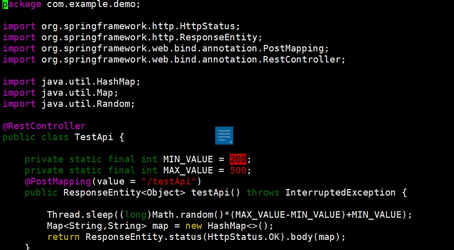
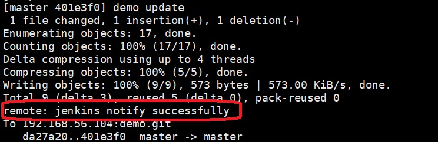
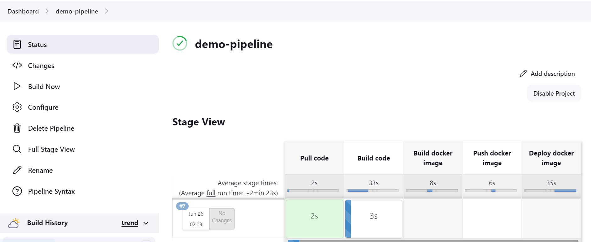
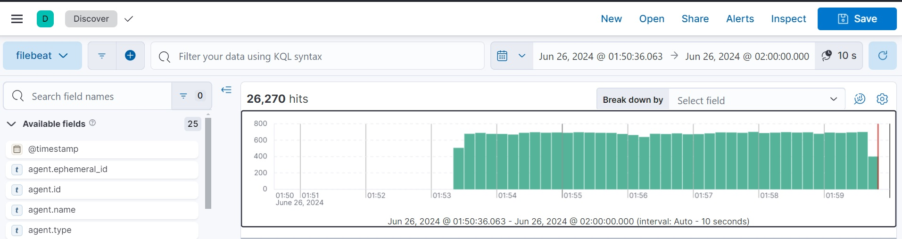
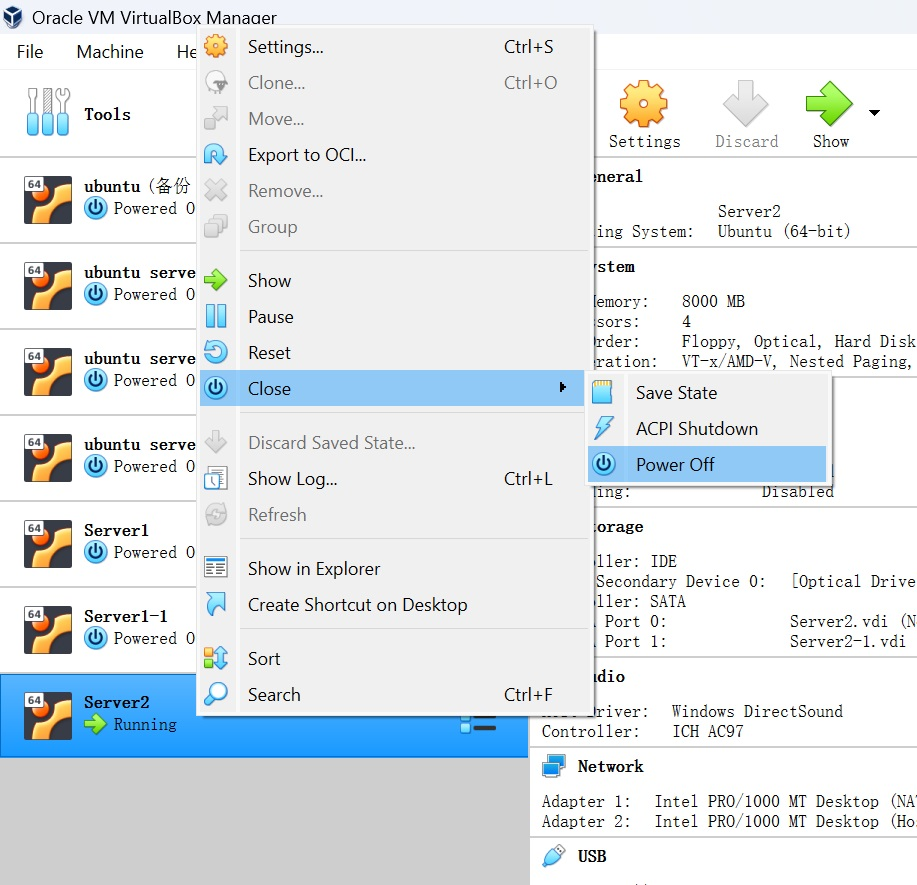

## Requisites
Refer to [Installation Guide](Installation.md) to install and initialize the demo devops environment.


## Start DevOps Software
Following commands to run all the software:
```
cd ~
~/software/jenkins/start.sh
~/nexus3/start.sh
~/elasticsearch/start.sh
~/kibana/start.sh
~/filebeat/start.sh
nginx
```

## Open Jenkins in browser
Login ```http://192.168.56.104:8002/job/demo-pipeline/``` via app/123456 and open the pipeline demo-pipeline

## Open Kibana in browser
Login ```http://192.168.56.104:8010/app/discover``` to monitor the application traffic

## Update code to trigger jenkins
Following commands to update sample code:
> Use vi to change the MIN_VALUE to a digit between 200 and 500.
> vi instruction:
> press i to enter edit mode in vi 
> press esc to exit edit mode 
> type :wq to save and quit vi
```
cd demo
vi src/main/java/com/example/demo/TestApi.java 
```


Following commands to commit the change and trigger jenkins pipeline:
```
git add .
git commit -a -m "demo update"
git push 
```
> After code is pushed, message 'jenkins notify successfully' means jenkins pipeline is triggered.


> Go to jenkins and check if pipeline is started.


> Go to kibana to monitor the traffic.



## Run Jmeter
Follow command to launch Jmeter:
```
cd ~/jmeter
./bin/jmeter -n -t demo.jmx 
```
> Use CTL+C to exit Jmeter when demo completed

## Shutdown server
After demo completed, shutdown the server in virtualbox

